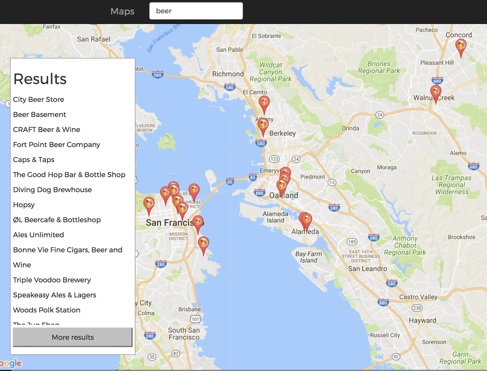

# googlePlacesSerach

## Name of Application
googlePlacesSerach
## Project Owner
Jon Miguel Jara

## Usage
load up index.html with the accompanying files: bundle3.js, custom.css and you are good to go!

## Features

*used google places API to search for things around the area that you are located. The default location is Berkeley but if you allow for locations services, it will got to your location. 

*hover over the list items on the side to find highlight the corresponding marker on the map

*used emoji search npm package to use the most relevant emoji as the marker labels. I found this feature pretty fun with words like “pizza”, “beer”, “burritos”, and “jewelry”
    -known bugs here: search for “Mexican” only returns Mexico the country 

*used browserify to package up the npm packages that used and deploy it on the server

*used Bootstrap nav bar and fluid containers

## SreenShots

<table id="characterTable">

<tr>
<td id = "first">  </td>
</tr>
